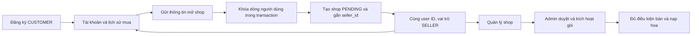
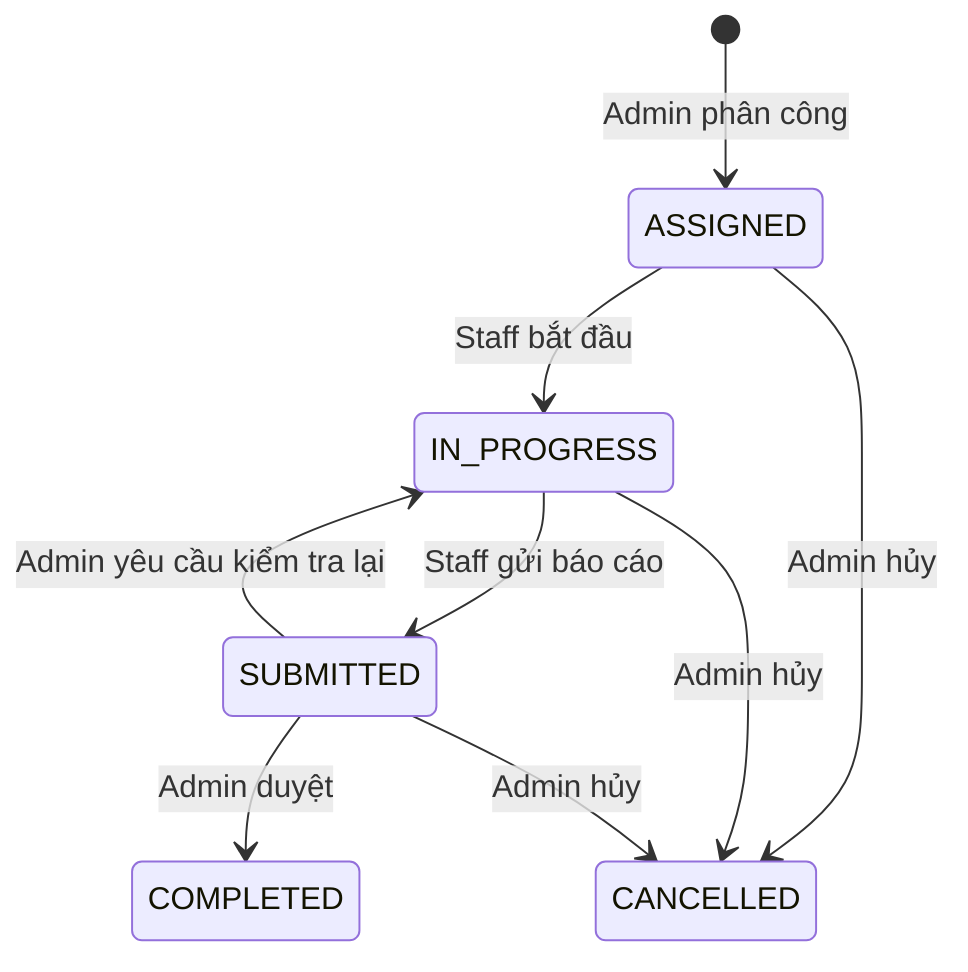

# Tài khoản và công việc FloraBot

## Bản chạy local

| Đường dẫn | Mục đích |
| --- | --- |
| `http://localhost:8088/` | Trang giới thiệu Next.js |
| `/dang-nhap` | Đăng nhập khách hàng và chủ shop |
| `/login` | Chuyển về `/dang-nhap` |
| `/admin/login` | Đăng nhập Admin và Staff |
| `/tai-khoan` | Hồ sơ, điểm, lịch sử mua, đặt trước và mở shop |
| `/seller` | Quản lý shop |
| `/admin` | Quản trị và phân công nhân viên |
| `/staff` | Công việc được giao cho nhân viên hiện tại |
| `/kiosk/` | Ứng dụng kiosk độc lập |
| `/lich-su-mua` | Biên nhận khách chủ động lưu trên thiết bị riêng |
| `/openapi/v1.json` | OpenAPI, cần phiên được cấp quyền |

Các tài khoản demo và mật khẩu local nằm trong `artifacts/demo-accounts.local.json`.
Tệp này được bỏ qua bởi Git. Có tài khoản `staff.demo@florabot.test` cho khu nhân viên.

## Một người vừa mua hoa vừa mở shop

`SELLER` hiện biểu diễn tài khoản có khả năng quản lý shop, đồng thời vẫn có quyền
mua hoa trên web. Mở shop không tạo người dùng thứ hai, không đổi mật khẩu/email,
không chuyển lịch sử sang ID khác và không xóa điểm. Gửi trùng được tuần tự hóa
bằng khóa dòng người dùng; API trả lại shop đã gắn với tài khoản.

Sau chuyển đổi, access token cũ bị từ chối do role/seller_id thay đổi. API cấp cookie
mới; nếu mất phản hồi, refresh hoặc đăng nhập lại khôi phục phiên với dữ liệu mới.
Shop PENDING chưa tự động có quyền bán hàng.

## Phân công nhân viên

- INCIDENT gắn với sự cố đang mở tại đúng tủ; một sự cố chỉ có một công việc chưa kết thúc.
- DELIVERY gắn với shop đang hoạt động và tủ có ô thuộc shop đó.
- Staff chỉ đọc và cập nhật công việc có `assignee_id` của mình. API kiểm tra quyền;
  SQL kiểm tra lại vai trò, trạng thái tài khoản, người được giao và phiên bản công việc.
- Cập nhật phiên bản cũ trả 409. Gửi lại phân công dùng cùng ID không tạo công việc thứ hai.
- Mỗi thay đổi ghi audit. Staff không tự duyệt báo cáo và không có quyền hoàn tiền.
- COMPLETED ở đây nghĩa là báo cáo công việc đã được duyệt. Nó không tự đóng sự cố,
  mở cửa, xác nhận nạp hoa hay chuyển tiền.

## Trạng thái triển khai

### Điều hướng dashboard

Admin dùng `/admin` làm trang tổng quan. Các nghiệp vụ có route riêng:
`/admin/orders`, `/admin/incidents`, `/admin/tasks`, `/admin/shops`, `/admin/slots`,
`/admin/complaints`, `/admin/refunds`, `/admin/withdrawals`, `/admin/reconciliation`.

Chủ shop dùng `/seller` làm tổng quan; các trang nghiệp vụ gồm `/seller/orders`,
`/seller/products`, `/seller/stock`, `/seller/accessories`, `/seller/subscriptions`,
`/seller/wallet`. Tài khoản mua hàng vẫn truy cập từ `/tai-khoan`.

Sidebar hiển thị trên desktop, menu có thể mở/đóng trên mobile. Chỉ nghiệp vụ đang
mở mới tải dữ liệu; trang tổng quan không gọi đồng loạt các API tài chính và hàng đợi.
Route nghiệp vụ không hợp lệ trả 404; quyền truy cập vẫn được kiểm tra bởi phiên FE
và chính sách BE. Staff tiếp tục dùng `/staff` cho công việc được phân công.

### Bàn giao người phụ trách

Admin đổi người phụ trách tại `/admin/tasks`, với nhân viên đang hoạt động khác người
hiện tại và lý do bàn giao 10–2000 ký tự. API
`POST /api/admin/staff-tasks/{taskId}/reassign` nhận `version`, `assigneeId`, `reason`.
Chỉ công việc ASSIGNED/IN_PROGRESS được đổi; công việc đang chờ duyệt cần được Admin
đánh giá trước. Bàn giao đặt lại trạng thái ASSIGNED, tăng version và ghi audit.

Staff cũ mất quyền đọc/cập nhật/nạp hoa ngay sau commit; Staff mới cần bắt đầu công việc.
Lịch sử và tồn kho đã ghi được giữ nguyên. Hai yêu cầu cùng version chỉ có một lần
thành công, yêu cầu còn lại trả 409. Nếu mất phản hồi, UI khóa gửi tiếp và yêu cầu tải
lại công việc để xác nhận người phụ trách hiện tại.

### Chi tiết và lịch sử công việc Staff (tra cứu)

`GET /api/staff/tasks/{taskId}?page=1` chỉ cho người đang được giao công việc xem;
Admin dùng `GET /api/admin/staff-tasks/{taskId}?page=1`. Kết quả gồm tình trạng tủ,
thời điểm tín hiệu gần nhất, ô liên quan, lý do/kết quả sự cố và lịch sử audit phân
trang 25 bản ghi. Không trả mã nhận hoa hoặc thông tin thanh toán của khách.
Mỗi trang được đọc trong một snapshot DB; API khóa chia sẻ nhiệm vụ khi kiểm tra
phân công. Tài khoản bị khóa mất quyền truy cập. Lịch sử dùng audit append-only đã có,
không tạo bản ghi giả cho các lần cập nhật cũ. Giao diện tải chi tiết khi người dùng mở,
có thử lại và cập nhật lịch sử sau khi ghi nhận nạp hoa/thay đổi phiên bản công việc.

### Danh tính mua hàng của chủ shop tại kiosk (OTP)

Migration `015_kiosk_member_identity.sql` cho phép số điện thoại của CUSTOMER hoặc
SELLER đang hoạt động xác thực OTP bằng cùng ID tài khoản. Số `+84` được chuẩn hóa
về `0` trước khi phát và kiểm tra mã. Tài khoản nội bộ hoặc bị khóa không được cấp phiên.

Phiên có `kiosk_id`, hết hạn sau 10 phút, chỉ mua hàng/tra cứu tại đúng tủ. Phiên này
không truy cập khu thành viên trên web, quản lý shop, ví shop hay hub vận hành.
Đơn hàng, điểm và lịch sử vẫn gắn với tài khoản gốc; chủ shop mua được hoa của shop khác.
Kiosk không cung cấp xóa tài khoản chủ shop: việc đóng shop cần xử lý các nghĩa vụ
còn lại qua hỗ trợ. API trả `canForgetAccount=false` ngay trong phản hồi OTP để UI
ẩn thao tác này trước khi khách tải lịch sử.

Trạng thái triển khai migration 015 được ghi ở tracker của năm repo.

### Staff nạp hoa theo phân công

Migration `014_staff_stock.sql` bổ sung nhật ký nạp hoa gắn với công việc DELIVERY.
`GET /api/staff/tasks/{taskId}/stock` trả mẫu hoa, ô trống hợp lệ và lịch sử nạp;
`POST` cùng đường dẫn nhận `id`, `productId`, `slotId`, `qrCode`.

- Chỉ Staff đang hoạt động, được giao đúng công việc đang IN_PROGRESS, mới nạp được.
- Mẫu hoa phải thuộc shop của công việc; ô phải thuộc đúng shop và tủ, còn trống,
  còn hiệu lực gói. Tủ bảo trì hoặc vô hiệu hóa không nhận nạp.
- Staff xác nhận đã đặt hoa vào ô trước khi ghi nhận. Đây là ghi nhận tồn kho,
  chưa phải lệnh điều khiển cửa hay bằng chứng từ cảm biến.
- ID thao tác được giữ trong phiên trình duyệt khi mất phản hồi. Gửi lại đúng ID
  và nội dung trả kết quả cũ; đổi nội dung với cùng ID trả 409. Việc khôi phục
  kết quả đã ghi vẫn được phép sau khi gửi báo cáo.
- Nhật ký tồn kho ghi người thực hiện là Staff, kèm ID công việc; dữ liệu và
  sự kiện cập nhật được ghi trong cùng giao dịch.

Trạng thái triển khai migration 014 được ghi ở tracker
`MIGRATION-NEXT-FIVE-REPOS.md` tại thư mục chứa năm repo.

Khách vãng lai có giao dịch lưu trong DB với `customer_id` để trống. Cặp ID–mã biên
nhận cho phép tra cứu riêng từng giao dịch. Sau khi nhận hoa thành công, khách có thể
đồng ý lưu mã trên trình duyệt cá nhân; `/lich-su-mua` hiển thị tối đa 50 bản lưu và
cho phép xóa từng bản hoặc toàn bộ. Không tự lưu mã ở kiosk, không có API liệt kê
mọi đơn khách vãng lai, không đồng bộ bản lưu sang thiết bị khác. Xóa bản lưu không
xóa đơn trong DB. Mỗi lần mở biên nhận vẫn tra cứu và kiểm tra mã ở backend.

Migration 011–016 đã áp dụng lên DB local sau khi sao lưu. API, Gateway và Next.js
đã được build và khởi động lại. Bản sao lưu trước migration:
`artifacts/florabot-pre-roles-20261008.dump`.

Còn phải hoàn thiện thao tác thiết bị theo phân công, bằng chứng công việc,
Mobile và kiểm tra tổng thể dashboard. Các workspace đã có route Next
App Router riêng; trạng thái triển khai ghi trong tracker. Tích hợp nhà
cung cấp và phần cứng thực tế chưa được xác nhận bởi các test giao diện/API local.

### Ảnh minh chứng Staff

- Staff tải ảnh bằng `POST /api/staff/tasks/{taskId}/evidence/upload`, body ảnh
  PNG/JPEG/WebP tối đa 5 MB. Công việc phải đang `IN_PROGRESS` và thuộc Staff.
- Kết quả trả `reference` có hạn 30 phút, gắn với người tải, công việc và phiên bản.
  Gọi `POST /api/staff/tasks/{taskId}/evidence` với `{ id, version, reference }`
  để gắn ảnh. Giữ nguyên ID khi gửi lại do mất phản hồi; trả cùng ngày tạo nếu
  thao tác đã lưu. Không nhận URL tự nhập, ảnh của nhiệm vụ khác hoặc vé hết hạn.
- `GET /api/staff/tasks/{taskId}/evidence?page=1` trả `items`, `page`, `hasMore`,
  tối đa 25 ảnh/trang; không trả URL Cloudinary. Đọc ảnh qua
  `GET /api/staff/tasks/{taskId}/evidence/{attachmentId}` với phiên đăng nhập.
  Admin dùng các route GET tương ứng dưới `/api/admin/staff-tasks`.
- Tham số `attachmentId` của API danh sách cho phép tra đúng mã ảnh khi khôi phục
  thao tác; vẫn kiểm tra quyền công việc, không cần tải nội dung ảnh để xác nhận.
- Người phụ trách cũ mất quyền xem/gửi sau bàn giao; người mới xem được ảnh
  đã lưu. Gửi báo cáo không xóa ảnh; không nhận ảnh mới khi đã `SUBMITTED`.
- Ảnh dùng Cloudinary authenticated hiện có. Backend kiểm tra loại ảnh,
  kích thước và SHA-256 khi đọc; lỗi nhà cung cấp/nội dung sai trả 503.
- Dashboard có mục “Ảnh minh chứng công việc”, tải danh sách khi mở mục này.
  Staff tải ảnh rồi xác nhận gắn vào công việc; Admin chỉ xem. Mã thao tác được
  giữ trong sessionStorage theo tài khoản/công việc khi mất phản hồi, kể cả sau
  khi tải lại trang. “Kiểm tra kết quả gửi ảnh” tra mã đã lưu trước khi gửi lại.
  Vé hết hạn và chưa lưu ảnh yêu cầu tải ảnh mới; lỗi kiểm tra giữ nguyên mã.

### Staff ghi nhận sửa xong sự cố

Migration 017 bổ sung `POST /api/staff/tasks/{taskId}/resolve-incident` với
`{ id, version, report }`. Chỉ Staff đang hoạt động, được giao công việc INCIDENT
đang IN_PROGRESS, mới thực hiện được. Báo cáo dài 10–2000 ký tự; phiên bản cũ trả
409. UI yêu cầu xác nhận đã kiểm tra thực tế tại tủ.

Thao tác dùng lại `flow.resolve_device_fault`: kiểm tra sự cố còn mở và khoản
hoàn tiền đang chờ đối với lỗi nhả hoa, sau đó khôi phục trạng thái ô theo tồn kho
và hợp đồng. Cùng giao dịch chuyển công việc sang SUBMITTED và ghi nhật ký.
Admin vẫn duyệt báo cáo riêng. API này không gửi lệnh mở cửa và không chi tiền.

ID thao tác được giữ trong sessionStorage khi chưa xác nhận được phản hồi. Gửi lại
cùng ID và nội dung trả kết quả cũ, kể cả sau khi Admin duyệt; đổi nội dung trả
409. Sau bàn giao, người phụ trách cũ không còn quyền thực hiện hoặc khôi phục
qua endpoint này. Trạng thái triển khai và kết quả kiểm thử ghi tại tracker.
