# FloraBot — ERD và 11 schema

Sinh từ metadata database local `florabot` ngày 08/10/2026, gồm các migration đang áp dụng. Không chứa bản ghi hoặc mật khẩu.

## 1. Tổng quan đủ 11 schema

Các đường dưới đây biểu diễn database chứa schema, không phải khóa ngoại.

```mermaid
flowchart TB
    DB["Database: florabot"]
    DB --> S_ai["ai<br/>1 bảng · 0 view · 0 routine"]
    DB --> S_cap["cap<br/>2 bảng · 0 view · 0 routine"]
    DB --> S_catalog["catalog<br/>1 bảng · 0 view · 0 routine"]
    DB --> S_flow["flow<br/>0 bảng · 0 view · 97 routine"]
    DB --> S_identity["identity<br/>4 bảng · 0 view · 0 routine"]
    DB --> S_kiosk_ops["kiosk_ops<br/>10 bảng · 0 view · 0 routine"]
    DB --> S_notify["notify<br/>2 bảng · 0 view · 0 routine"]
    DB --> S_ordering["ordering<br/>4 bảng · 0 view · 0 routine"]
    DB --> S_payment["payment<br/>4 bảng · 1 view · 2 routine"]
    DB --> S_public["public<br/>0 bảng · 0 view · 230 routine"]
    DB --> S_screen["screen<br/>0 bảng · 10 view · 0 routine"]
```

| Schema | Bảng | View | Routine | Vai trò |
|---|---:|---:|---:|---|
| `ai` | 1 | 0 | 0 | Khảo sát tư vấn hoa |
| `cap` | 2 | 0 | 0 | Outbox/inbox của CAP phục vụ xử lý sự kiện |
| `catalog` | 1 | 0 | 0 | Danh mục mẫu hoa |
| `flow` | 0 | 0 | 97 | Hàm nghiệp vụ; không phải bảng dữ liệu |
| `identity` | 4 | 0 | 0 | Tài khoản, shop, gói thuê và đăng ký gói |
| `kiosk_ops` | 10 | 0 | 0 | Tủ, ô, bó hoa, phụ kiện và thiết bị |
| `notify` | 2 | 0 | 0 | Thông báo và ảnh đính kèm |
| `ordering` | 4 | 0 | 0 | Đơn hàng, chi tiết đơn và yêu cầu đặt trước |
| `payment` | 4 | 1 | 2 | Thanh toán, hoàn tiền và sổ cái |
| `public` | 0 | 0 | 230 | Hàm dùng chung và đối tượng mở rộng PostgreSQL |
| `screen` | 0 | 10 | 0 | View phục vụ đọc dữ liệu cho giao diện |

Routine bao gồm function/procedure và có thể bao gồm hàm do extension cài đặt.

## 2. ERD các bảng thực tế

Tổng cộng **28 bảng**, **20 ràng buộc khóa ngoại**. Schema không có bảng được trình bày trong sơ đồ tổng quan, không tạo bảng giả trong ERD.

PK: khóa chính; FK: khóa ngoại được PostgreSQL khai báo; UK: cột thuộc ràng buộc duy nhất. Với khóa ghép, các cột cùng ràng buộc mới tạo thành khóa; không hiểu từng cột là duy nhất riêng.

`||`: đúng một; `|o`: không hoặc một; `o{`: không hoặc nhiều. Nét đứt biểu diễn quan hệ không định danh trong ký pháp Mermaid, không có nghĩa là khóa ngoại giả. Nhãn cạnh là cột khóa ngoại phía bảng con.

Các tham chiếu logic được kiểm tra bằng hàm nghiệp vụ nhưng không có FOREIGN KEY trong PostgreSQL không được vẽ thành FK trong sơ đồ này. Vì vậy một bảng đứng riêng không có nghĩa là không liên quan nghiệp vụ.

```mermaid
erDiagram
    direction LR
    ai__gift_surveys["ai.gift_surveys"] {
        uuid id PK "NOT NULL"
        text session_id "NOT NULL"
        uuid customer_id
        uuid kiosk_id "NOT NULL"
        text recipient_type "NOT NULL"
        text age_group
        text occasion "NOT NULL"
        text message_tone
        int8 budget_max
        jsonb results "NOT NULL"
        text model_version
        text source
        int4 latency_ms
        uuid selected_product_id
        uuid purchased_order_id
        timestamptz created_at "NOT NULL"
        timestamptz updated_at "NOT NULL"
    }
    cap__published["cap.published"] {
        int8 Id PK "NOT NULL"
        varchar Version "NOT NULL"
        varchar Name "NOT NULL"
        text Content
        int4 Retries "NOT NULL"
        timestamp Added "NOT NULL"
        timestamp ExpiresAt
        varchar StatusName "NOT NULL"
    }
    cap__received["cap.received"] {
        int8 Id PK "NOT NULL"
        varchar Version "NOT NULL"
        varchar Name "NOT NULL"
        varchar Group
        text Content
        int4 Retries "NOT NULL"
        timestamp Added "NOT NULL"
        timestamp ExpiresAt
        varchar StatusName "NOT NULL"
    }
    catalog__flower_products["catalog.flower_products"] {
        uuid id PK "NOT NULL"
        uuid seller_id "NOT NULL"
        text name "NOT NULL"
        text description
        int8 price "NOT NULL"
        text_array tags "NOT NULL"
        int4 shelf_life_hours "NOT NULL"
        text status "NOT NULL"
        timestamptz created_at "NOT NULL"
        timestamptz updated_at "NOT NULL"
    }
    identity__sellers["identity.sellers"] {
        uuid id PK "NOT NULL"
        text shop_name "NOT NULL"
        text phone "NOT NULL"
        text address
        text status "NOT NULL"
        uuid package_id FK
        date package_expires_at
        text brand_tone
        text bank_name
        text bank_account_no_enc
        text bank_holder
        timestamptz created_at "NOT NULL"
        timestamptz updated_at "NOT NULL"
    }
    identity__subscription_packages["identity.subscription_packages"] {
        uuid id PK "NOT NULL"
        text name UK "NOT NULL"
        int8 monthly_fee "NOT NULL"
        int4 max_slots "NOT NULL"
        text status "NOT NULL"
        timestamptz created_at "NOT NULL"
        timestamptz updated_at "NOT NULL"
    }
    identity__subscriptions["identity.subscriptions"] {
        uuid id PK "NOT NULL"
        uuid seller_id FK "NOT NULL"
        uuid package_id FK "NOT NULL"
        date period_from "NOT NULL"
        date period_to "NOT NULL"
        int8 price "NOT NULL"
        text status "NOT NULL"
        uuid payment_id
        timestamptz created_at "NOT NULL"
        timestamptz updated_at "NOT NULL"
    }
    identity__users["identity.users"] {
        uuid id PK "NOT NULL"
        text email UK
        text phone UK
        text password_hash
        text full_name "NOT NULL"
        text role "NOT NULL"
        uuid seller_id FK
        text status "NOT NULL"
        int8 loyalty_points "NOT NULL"
        timestamptz created_at "NOT NULL"
        timestamptz updated_at "NOT NULL"
    }
    kiosk_ops__accessories["kiosk_ops.accessories"] {
        uuid id PK "NOT NULL"
        uuid seller_id UK "NOT NULL"
        uuid kiosk_id FK,UK "NOT NULL"
        text name UK "NOT NULL"
        int8 price "NOT NULL"
        int4 stock_quantity "NOT NULL"
        text status "NOT NULL"
        timestamptz created_at "NOT NULL"
        timestamptz updated_at "NOT NULL"
    }
    kiosk_ops__bouquets["kiosk_ops.bouquets"] {
        uuid id PK "NOT NULL"
        uuid product_id "NOT NULL"
        uuid seller_id "NOT NULL"
        text qr_code UK "NOT NULL"
        int8 price_snapshot "NOT NULL"
        text status "NOT NULL"
        timestamptz sellable_until "NOT NULL"
        timestamptz stocked_at "NOT NULL"
        timestamptz created_at "NOT NULL"
        timestamptz updated_at "NOT NULL"
    }
    kiosk_ops__inventory_logs["kiosk_ops.inventory_logs"] {
        uuid id PK "NOT NULL"
        int8 seq UK "NOT NULL"
        uuid bouquet_id FK "NOT NULL"
        uuid slot_id FK "NOT NULL"
        text movement_type "NOT NULL"
        uuid batch_id
        uuid order_id
        uuid performed_by
        text reason
        timestamptz created_at "NOT NULL"
    }
    kiosk_ops__kiosks["kiosk_ops.kiosks"] {
        uuid id PK "NOT NULL"
        text code UK "NOT NULL"
        text name "NOT NULL"
        text address "NOT NULL"
        text region "NOT NULL"
        text hardware_id UK "NOT NULL"
        text mqtt_client_id UK "NOT NULL"
        text status "NOT NULL"
        timestamptz last_heartbeat_at
        text api_key_hash
        timestamptz created_at "NOT NULL"
        timestamptz updated_at "NOT NULL"
    }
    kiosk_ops__mqtt_dispatches["kiosk_ops.mqtt_dispatches"] {
        uuid cmd_id PK,FK "NOT NULL"
        uuid delivery_id "NOT NULL"
        timestamptz attempted_at "NOT NULL"
        timestamptz next_attempt_at "NOT NULL"
        timestamptz pubacked_at
    }
    kiosk_ops__mqtt_inbox["kiosk_ops.mqtt_inbox"] {
        uuid event_id PK "NOT NULL"
        uuid kiosk_id FK "NOT NULL"
        uuid cmd_id FK
        text event "NOT NULL"
        text payload_hash "NOT NULL"
        timestamptz occurred_at "NOT NULL"
        timestamptz received_at "NOT NULL"
        timestamptz processed_at
        text disposition "NOT NULL"
    }
    kiosk_ops__slot_assignments["kiosk_ops.slot_assignments"] {
        uuid id PK "NOT NULL"
        uuid slot_id FK "NOT NULL"
        uuid seller_id "NOT NULL"
        uuid assigned_by "NOT NULL"
        timestamptz assigned_at "NOT NULL"
        text status "NOT NULL"
        timestamptz released_at
        text release_reason
    }
    kiosk_ops__slots["kiosk_ops.slots"] {
        uuid id PK "NOT NULL"
        uuid kiosk_id FK,UK "NOT NULL"
        text slot_code UK "NOT NULL"
        text status "NOT NULL"
        uuid current_seller_id
        uuid bouquet_id FK,UK
        timestamptz hold_until
        uuid hold_order_id
        int4 row_version "NOT NULL"
        int2 relay_channel UK "NOT NULL"
        timestamptz created_at "NOT NULL"
        timestamptz updated_at "NOT NULL"
    }
    kiosk_ops__system_settings["kiosk_ops.system_settings"] {
        text key PK "NOT NULL"
        jsonb value "NOT NULL"
        text description
        uuid updated_by
        timestamptz updated_at "NOT NULL"
    }
    kiosk_ops__unlock_tokens["kiosk_ops.unlock_tokens"] {
        uuid id PK "NOT NULL"
        uuid kiosk_id FK "NOT NULL"
        uuid slot_id FK "NOT NULL"
        text purpose "NOT NULL"
        uuid order_id
        uuid issued_to_user_id
        text token_hash UK "NOT NULL"
        uuid cmd_id UK "NOT NULL"
        text status "NOT NULL"
        int4 attempts "NOT NULL"
        timestamptz issued_at "NOT NULL"
        timestamptz expires_at "NOT NULL"
        timestamptz door_opened_at
        timestamptz door_closed_at
    }
    notify__attachments["notify.attachments"] {
        uuid id PK "NOT NULL"
        text owner_service "NOT NULL"
        text owner_type "NOT NULL"
        uuid owner_id "NOT NULL"
        text file_url "NOT NULL"
        text mime_type "NOT NULL"
        int8 size_bytes "NOT NULL"
        text sha256 "NOT NULL"
        text phase "NOT NULL"
        uuid uploaded_by
        timestamptz created_at "NOT NULL"
    }
    notify__audit_logs["notify.audit_logs"] {
        int8 id PK "NOT NULL"
        text actor_type "NOT NULL"
        uuid actor_id
        text action "NOT NULL"
        text entity_type "NOT NULL"
        uuid entity_id
        jsonb payload
        timestamptz created_at "NOT NULL"
    }
    ordering__disputes["ordering.disputes"] {
        uuid id PK "NOT NULL"
        text kind "NOT NULL"
        uuid order_id FK
        uuid kiosk_id "NOT NULL"
        uuid slot_id
        text reason "NOT NULL"
        uuid reported_by
        text status "NOT NULL"
        text decision
        int8 refund_amount
        uuid decided_by
        timestamptz resolved_at
        timestamptz created_at "NOT NULL"
        timestamptz updated_at "NOT NULL"
    }
    ordering__order_items["ordering.order_items"] {
        uuid id PK "NOT NULL"
        uuid order_id FK "NOT NULL"
        text item_type "NOT NULL"
        uuid bouquet_id
        uuid accessory_id
        uuid slot_id
        text name_snapshot "NOT NULL"
        int4 quantity "NOT NULL"
        int8 unit_price "NOT NULL"
        int8 line_total "NOT NULL"
        text line_status "NOT NULL"
        timestamptz created_at "NOT NULL"
    }
    ordering__orders["ordering.orders"] {
        uuid id PK "NOT NULL"
        text order_code UK "NOT NULL"
        uuid checkout_id "NOT NULL"
        uuid customer_id
        uuid seller_id "NOT NULL"
        uuid kiosk_id "NOT NULL"
        text status "NOT NULL"
        int8 subtotal "NOT NULL"
        int8 discount_amount "NOT NULL"
        int8 total_amount "NOT NULL"
        int8 points_redeemed "NOT NULL"
        int8 points_earned "NOT NULL"
        text tracking_token UK "NOT NULL"
        text ecard_content
        timestamptz completed_at
        text refund_bank_name
        text refund_bank_account_enc
        text refund_bank_holder
        timestamptz created_at "NOT NULL"
        timestamptz updated_at "NOT NULL"
    }
    ordering__web_requests["ordering.web_requests"] {
        uuid id PK "NOT NULL"
        uuid customer_id "NOT NULL"
        uuid seller_id "NOT NULL"
        uuid product_id "NOT NULL"
        uuid kiosk_id "NOT NULL"
        text kind "NOT NULL"
        text instructions "NOT NULL"
        timestamptz pickup_at "NOT NULL"
        timestamptz pickup_before "NOT NULL"
        int8 quoted_price
        text quote_note
        timestamptz quote_expires_at
        text state "NOT NULL"
        uuid order_id FK,UK
        timestamptz created_at "NOT NULL"
        timestamptz updated_at "NOT NULL"
        jsonb request_payload
        jsonb display_snapshot "NOT NULL"
    }
    payment__gateway_orders["payment.gateway_orders"] {
        uuid payment_id PK,FK "NOT NULL"
        int8 order_code UK "NOT NULL"
        text checkout_url
        timestamptz created_at "NOT NULL"
    }
    payment__ledger_entries["payment.ledger_entries"] {
        uuid id PK "NOT NULL"
        uuid journal_id "NOT NULL"
        text account "NOT NULL"
        uuid seller_id
        int8 amount "NOT NULL"
        text ref_type "NOT NULL"
        uuid ref_id "NOT NULL"
        text memo
        timestamptz created_at "NOT NULL"
    }
    payment__payments["payment.payments"] {
        uuid id PK "NOT NULL"
        text kind "NOT NULL"
        text purpose "NOT NULL"
        uuid checkout_id
        uuid order_id
        uuid subscription_id
        uuid parent_payment_id FK
        text gateway UK "NOT NULL"
        text gateway_txn_id UK
        text idempotency_key UK "NOT NULL"
        int8 amount "NOT NULL"
        text status "NOT NULL"
        uuid approved_by
        text reason
        jsonb raw_payload
        timestamptz paid_at
        timestamptz created_at "NOT NULL"
        timestamptz updated_at "NOT NULL"
        uuid paid_by
    }
    payment__withdrawal_requests["payment.withdrawal_requests"] {
        uuid id PK "NOT NULL"
        uuid seller_id "NOT NULL"
        int8 amount "NOT NULL"
        text status "NOT NULL"
        text bank_name "NOT NULL"
        text bank_account_no_enc "NOT NULL"
        text bank_holder "NOT NULL"
        uuid approved_by
        text reject_reason
        timestamptz paid_at
        timestamptz created_at "NOT NULL"
        timestamptz updated_at "NOT NULL"
        uuid paid_by
        timestamptz approved_at
    }
    identity__subscription_packages |o..o{ identity__sellers : "package_id"
    identity__subscription_packages ||..o{ identity__subscriptions : "package_id"
    identity__sellers ||..o{ identity__subscriptions : "seller_id"
    identity__sellers |o..o{ identity__users : "seller_id"
    kiosk_ops__kiosks ||..o{ kiosk_ops__accessories : "kiosk_id"
    kiosk_ops__bouquets ||..o{ kiosk_ops__inventory_logs : "bouquet_id"
    kiosk_ops__slots ||..o{ kiosk_ops__inventory_logs : "slot_id"
    kiosk_ops__unlock_tokens ||..o| kiosk_ops__mqtt_dispatches : "cmd_id"
    kiosk_ops__unlock_tokens |o..o{ kiosk_ops__mqtt_inbox : "cmd_id"
    kiosk_ops__kiosks ||..o{ kiosk_ops__mqtt_inbox : "kiosk_id"
    kiosk_ops__slots ||..o{ kiosk_ops__slot_assignments : "slot_id"
    kiosk_ops__bouquets |o..o| kiosk_ops__slots : "bouquet_id"
    kiosk_ops__kiosks ||..o{ kiosk_ops__slots : "kiosk_id"
    kiosk_ops__kiosks ||..o{ kiosk_ops__unlock_tokens : "kiosk_id"
    kiosk_ops__slots ||..o{ kiosk_ops__unlock_tokens : "slot_id"
    ordering__orders |o..o{ ordering__disputes : "order_id"
    ordering__orders ||..o{ ordering__order_items : "order_id"
    ordering__orders |o..o| ordering__web_requests : "order_id"
    payment__payments ||..o| payment__gateway_orders : "payment_id"
    payment__payments |o..o{ payment__payments : "parent_payment_id"
```

## 3. Cách lần theo code

- FE gửi HTTP qua `FE/apps/portal/src/api.ts`.
- BE kiểm tra quyền tại `Program.cs` và endpoint của từng module.
- Endpoint đọc bảng/view hoặc gọi hàm `flow.*`; các hàm cập nhật dữ liệu trong giao dịch.
- `screen` cung cấp view đọc cho giao diện; `cap` hỗ trợ sự kiện bất đồng bộ.
- Ví dụ đặt hoa: `FlowerShop.tsx` → `WebOrders.cs` → hàm trong `010_web_preorders.sql` → `ordering.web_requests` và các bảng liên quan.
